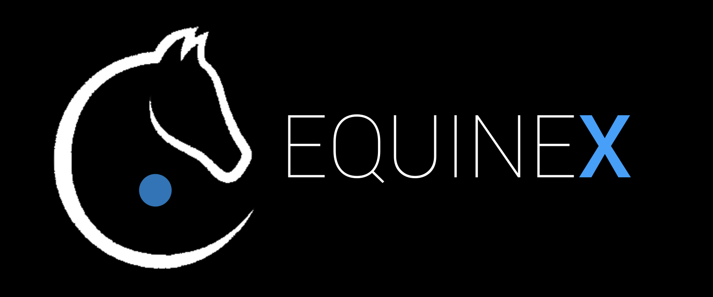
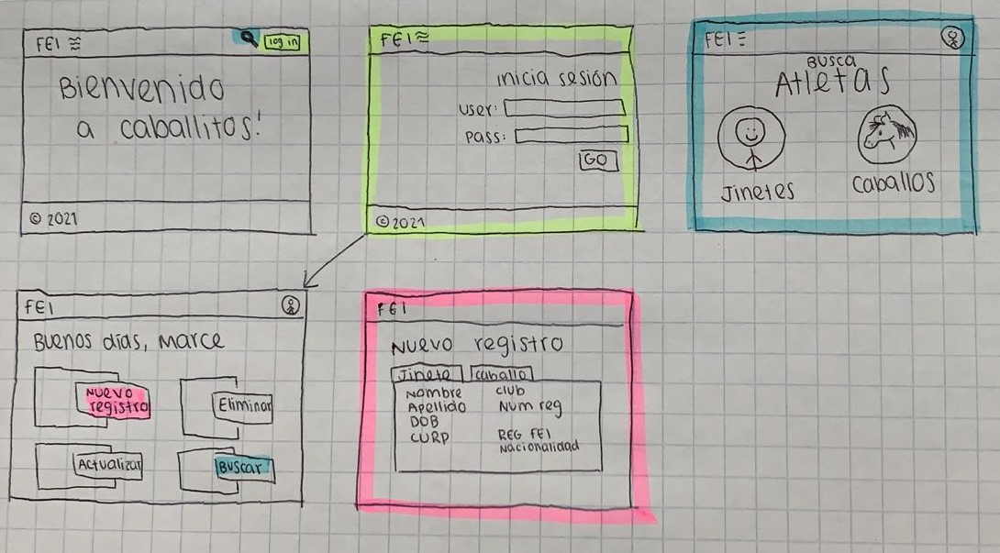

# Proyecto Final de Desarrollo de Aplicaciones Web
_Marcela Fuentes (A01748161) y Víctor Coeto (A01654866)_



## Descripción
En la realidad actual, los registros en papel son cosa del pasado. Basada en MongoDB y Express, EquineX es una plataforma web que agiliza el proceso digital de búsqueda y registro de jinetes y caballos afiliados en la Federación Ecuestre Mexicana. Además de los datos básicos de cada atleta, podrán encontrarse sus resultados en los concursos avalados por la FEM. Los administradores tienen acceso a la parte de edición para agregar, actualizar, o eliminar datos; pero cualquier persona puede buscar a los atletas de su interés. No importa si eres un jinete nuevo asociándose a la FEM por primera vez, un posible comprador de un caballo buscando su palmarés, o un entrenador analizando los resultados de sus alumnos, EquineX es la solución más eficiente y práctica para ti. 

## Borrador de las pantallas
 

## Backend
El backend fue realizado en un archivo javascript llamado java.js.

## Frontend 
El frontend fue realizado utilizando archivos HTML y CSS que pueden ser encontrados en la carpeta public library.

## Instrucciones de uso
Para utilizar EquineX, es necesario correr los siguientes comandos en consola:
```
git clone https://github.com/vcoeto/ProyectoFinalWeb
cd ProyectoFinalWeb
npm install
node index.js
```

La consola imprimirá un mensaje diciendo que la plataforma está disponible en un link en localhost, al entrar a este se desplegará la página principal. 


## Futuras mejoras y correcciones

- El sistema de login actual tiene un problema al tratar de inciar sesión más de una vez; es necesario generar una mejor interfaz para el login y actualizar el código para tener el registro de la sesión
- Mejorar el javascript para el backend
- Optimizar la página principal con un mejor diseño
- Optimizar la página de búsqueda 
- Optimizar la función de actualizar
- Crear perfiles de administrador y de usuario regular
- Incluir resultados y estadísticas de desempeño en concursos
- Generación de rankings de circuitos metropolitanos, nacionales, internacionales
- Enlace con la base de datos FEI
- Sección de administración de competencias en tiempo real
